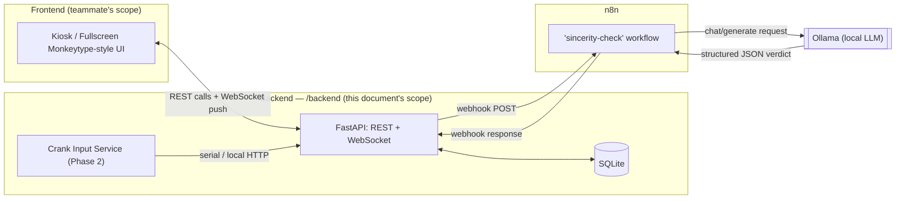
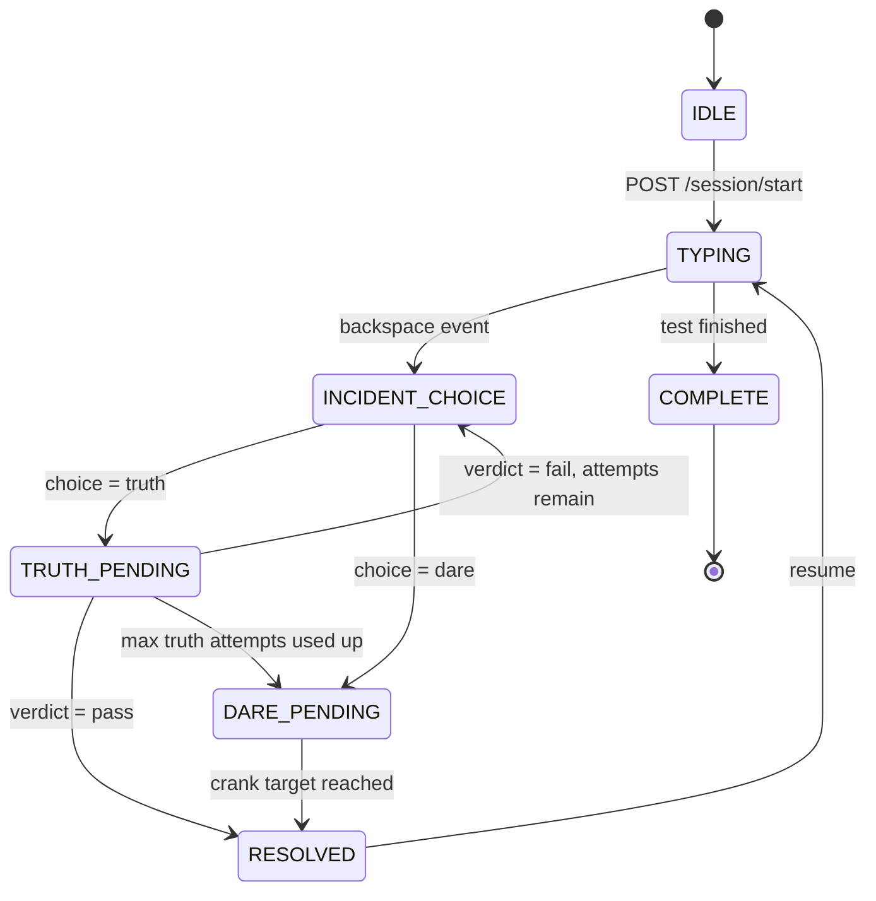
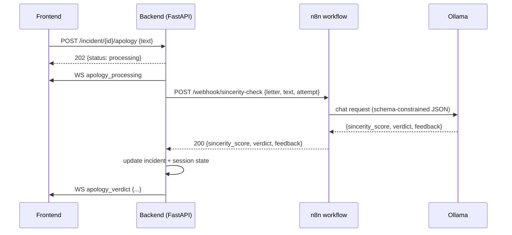
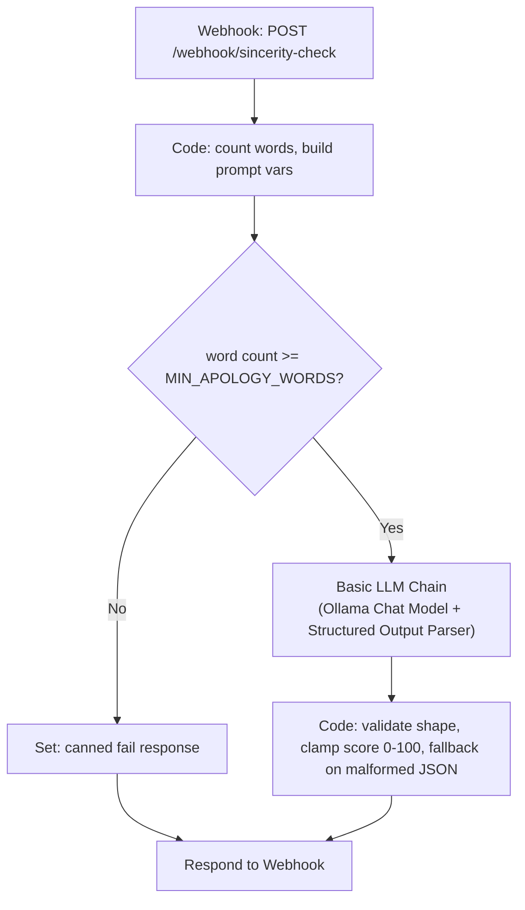

# Type & Atone — Backend Architecture & Build Guide
**A Monkeytype clone where deleting a letter has consequences.**

*(Working title — a TinkerHub "Useless Projects" hackathon submission. Rename however you like; nothing in this document depends on the name.)*

> **Note to whoever implements this (human or AI):** This document is the complete specification for the **backend only**. It intentionally contains no working source code — only architecture, contracts, data shapes, and step-by-step build guidance, so that implementation can start directly from it. The frontend (the actual Monkeytype-look UI, the fullscreen/kiosk shell, animations, sound playback, and visual transitions) is being built separately by a teammate and is **out of scope** here. Build in the order given in [Section 19](#19-roadmap--phased-delivery): the TRUTH path is Phase 1 and comes first; the DARE/hardware path is Phase 2 and comes after. Anywhere this document says a number or behavior is "configurable," implement it as an environment variable, not a hard-coded constant. Anywhere it's flagged as an "Open Decision," don't silently invent an answer — surface it back to the human team.

---

## Table of Contents
0. [TL;DR](#0-tldr)
1. [Scope & Team Boundary](#1-scope--team-boundary)
2. [Concept Recap](#2-concept-recap)
3. [High-Level Architecture](#3-high-level-architecture)
4. [Session Lifecycle (State Machine)](#4-session-lifecycle-state-machine)
5. [Repository Layout](#5-repository-layout)
6. [Data Model](#6-data-model)
7. [REST API Contract](#7-rest-api-contract)
8. [WebSocket Event Contract](#8-websocket-event-contract)
9. [The TRUTH Path — Apology Sincerity Pipeline](#9-the-truth-path--apology-sincerity-pipeline)
10. [The DARE Path — Physical Cranker (Phase 2)](#10-the-dare-path--physical-cranker-phase-2)
11. [Per-Letter Persona Data](#11-per-letter-persona-data)
12. [Sound Cue Contract](#12-sound-cue-contract)
13. [Configuration Reference (.env)](#13-configuration-reference-env)
14. [Local Development Setup](#14-local-development-setup)
15. [Resilience & Demo-Day Safety Nets](#15-resilience--demo-day-safety-nets)
16. [Testing Strategy](#16-testing-strategy)
17. [Security & Privacy Notes](#17-security--privacy-notes)
18. [Accessibility Note](#18-accessibility-note)
19. [Roadmap / Phased Delivery](#19-roadmap--phased-delivery)
20. [Open Decisions For The Team](#20-open-decisions-for-the-team)
21. [Assumptions Made In This Document](#21-assumptions-made-in-this-document)
22. [Appendix: Full Incident Walkthrough](#22-appendix-full-incident-walkthrough)

---

## 0. TL;DR

- **What it is:** backend for a Monkeytype-style typing test where pressing Backspace "hurts" the letter you just deleted and locks you into a **TRUTH or DARE** consequence before you can resume typing.
- **TRUTH (build this first):** the player writes a ≥50-word apology addressed to the letter. A local **Ollama** LLM, called through an **n8n** workflow, judges the apology's sincerity and only lets the player continue if it clears a threshold.
- **DARE (build this second, Phase 2):** the player physically cranks a cardboard wheel a required number of times, read by a sensor or a webcam. Required cranks increase every time DARE is chosen.
- **Stack:** Python 3.11+ / FastAPI, SQLite, native WebSockets for real-time UI push, n8n for orchestration, Ollama for local inference. Nothing calls out to the cloud — everything runs on `localhost`.
- **Scope:** backend only. This document defines the exact contract (REST + WebSocket) the frontend integrates against, but frontend implementation itself is a teammate's job.

---

## 1. Scope & Team Boundary

**This repo's `/backend` owns:**
- The session/game state machine and all game logic (incidents, choices, scoring, difficulty scaling).
- The REST API and WebSocket server the frontend talks to.
- Orchestrating the n8n workflow and Ollama for sincerity judging.
- Reading crank/hardware input and turning it into progress events (Phase 2).
- Persistence (SQLite) and final score computation.

**Explicitly NOT this repo's job (the teammate's frontend):**
- The actual Monkeytype-look typing UI, word rendering, caret, timer display.
- The fullscreen/kiosk lock-in behavior (disabling Alt+F4/Esc, hiding window chrome, blocking exit). This is application-shell code (e.g., inside Electron's main process) that lives alongside the UI, not in `/backend`. Whoever owns the Electron shell should treat [Section 7](#7-rest-api-contract) and [Section 8](#8-websocket-event-contract) as the integration contract.
- All animations/transitions, including the "TRUTH or DARE?" landing page and the per-letter apology pages.
- Actually playing sound effects. The backend only tells the frontend *which* sound cue fired (see [Section 12](#12-sound-cue-contract)); the `.mp3`/`.wav` files in the `/sounds` folder and the code that plays them belong to the frontend.

**One product/legal note, not a backend concern but worth flagging to whoever owns the frontend:** an exact pixel-for-pixel clone of Monkeytype's UI is completely normal for a non-commercial hackathon demo. If this project is ever open-sourced or deployed somewhere public afterward, it's worth giving it distinct branding and crediting Monkeytype as the inspiration, rather than shipping something that could be mistaken for the original.

---

## 2. Concept Recap

1. Player starts a full-screen typing test. They cannot exit until the test is complete (frontend-enforced).
2. Every time the player presses **Backspace**, the letter they just deleted is treated as having been "hurt." A sound cue fires and the screen transitions to a **TRUTH or DARE** choice screen.
3. **DARE** *(Phase 2)*: the player must crank a physical cardboard wheel a required number of times (increasing with each DARE chosen this session). Once the target is reached, they're returned to the typing test at the exact point they left off.
4. **TRUTH** *(Phase 1 — build this first)*: the player is shown a page personalized to the specific letter they deleted, with a textbox. They must write a sincere apology of at least 50 words addressed to that letter. A local LLM (Ollama) judges the apology for genuine sincerity. If it clears the pass threshold, the player is shown an acceptance graphic and returned to typing. If not, they can retry (up to a cap — see [Section 9](#9-the-truth-path--apology-sincerity-pipeline)).
5. Finishing the test ends the ordeal and returns final stats.

---

## 3. High-Level Architecture



### Tech stack

| Layer | Choice | Why |
|---|---|---|
| Backend language/framework | **Python 3.11+, FastAPI, Uvicorn** | Async-native, built-in WebSocket support, Pydantic validation, auto-generated OpenAPI docs the frontend teammate can browse, and the path of least resistance to Ollama/OpenCV/pyserial. |
| Data validation | Pydantic v2 | Ships with FastAPI; used for every request/response body. |
| Persistence | SQLite via SQLModel | Zero-setup file DB, fine for a hackathon demo; upgrade path to Postgres if ever needed. |
| Real-time push | Native FastAPI `WebSocket` | One dependency fewer than Socket.IO. (Flagged as an [Open Decision](#20-open-decisions-for-the-team) — confirm the frontend can speak raw WebSocket rather than needing Socket.IO's protocol.) |
| HTTP client (backend → n8n) | `httpx` (async) | Non-blocking calls out to n8n so the API server never stalls. |
| Orchestration | **n8n** (self-hosted) | Runs the apology-judging pipeline as a visual workflow per the hackathon's explicit ask to use n8n/webhooks. |
| LLM | **Ollama**, local | Sincerity judging never leaves the machine — no API keys, no cloud cost, no privacy concern with what players type. |
| Hardware (Phase 2) | `pyserial` (Arduino) and/or OpenCV (webcam) | Two swappable ways to count wheel rotations — see [Section 10](#10-the-dare-path--physical-cranker-phase-2). |
| Testing | `pytest` + `pytest-httpx` (to mock the n8n call) | Lets game-logic and formulas be tested without Ollama/n8n running. |

> **Open Decision:** Node.js/Express + Socket.IO is a completely reasonable alternative if the team is more comfortable there — n8n itself runs on Node, and if the frontend is an Electron app, the Electron main process is already JS. Python is the default recommendation here because of Ollama/OpenCV/pyserial ergonomics, not because Node can't do the job.

---

## 4. Session Lifecycle (State Machine)

The backend is the single source of truth for session state. This also **solves duplicate-trigger prevention for free**: if the player holds Backspace down and fires several keydown events in the same instant, only the first one lands, because the backend refuses to open a new incident while one is already active — no timing-based debounce needed.



| State | Meaning | Backspace events accepted? |
|---|---|---|
| `IDLE` | Session created but test not started | No |
| `TYPING` | Normal typing | **Yes — the only state that accepts a new incident** |
| `INCIDENT_CHOICE` | Truth/Dare choice screen showing | No |
| `TRUTH_PENDING` | Apology textbox shown, or apology submitted and awaiting verdict | No |
| `DARE_PENDING` | Crank screen showing, progress incoming | No |
| `RESOLVED` | Brief transition back to typing | No |
| `COMPLETE` | Test finished | No |

Any `POST /session/{id}/backspace` received while state isn't `TYPING` returns **HTTP 409 Conflict** — the frontend should treat this as "ignore, an incident is already in progress" rather than an error to surface to the player.

---

## 5. Repository Layout

This is the target structure. **Do not scaffold this yet per the hackathon owner's instructions — this document comes first.** Once implementation starts, build it out like this:

```text
/useless
├── README.md                      # this file
├── /sounds/                       # managed by the project owner, not by backend code
├── /backend
│   ├── requirements.txt
│   ├── .env.example
│   ├── /src
│   │   ├── main.py                 # FastAPI app entrypoint, mounts routers + WS
│   │   ├── /api                    # REST route handlers, one module per resource
│   │   │   ├── sessions.py
│   │   │   ├── incidents.py
│   │   │   └── letters.py
│   │   ├── /ws
│   │   │   └── connection_manager.py
│   │   ├── /services
│   │   │   ├── n8n_client.py        # thin httpx wrapper around the webhook
│   │   │   ├── sincerity_gate.py     # word-count pre-filter + escalation rules
│   │   │   ├── difficulty.py         # crank/threshold scaling formulas
│   │   │   └── /hardware             # Phase 2
│   │   │       ├── base.py           # CrankInputProvider interface
│   │   │       ├── serial_provider.py
│   │   │       └── vision_provider.py
│   │   ├── /models                  # SQLModel table definitions
│   │   │   ├── session.py
│   │   │   ├── incident.py
│   │   │   └── letter.py
│   │   ├── /db
│   │   │   └── database.py
│   │   └── /config
│   │       └── settings.py           # pydantic-settings, reads .env
│   └── /tests
│       ├── test_state_machine.py
│       └── test_difficulty.py
├── /n8n
│   └── /workflows
│       └── sincerity-check.json      # exported n8n workflow
└── .gitignore                        # .env, *.db, __pycache__, node_modules
```

---

## 6. Data Model

Three entities. Keep them this simple for the hackathon — no need for a users/auth table since this is a single-player kiosk experience.

**`sessions`**
| Field | Type | Notes |
|---|---|---|
| `id` | UUID (PK) | |
| `state` | enum | one of the state-machine states in [Section 4](#4-session-lifecycle-state-machine) |
| `target_text` | text | the word list generated for this test |
| `dare_attempt_count` | int | increments every time DARE is chosen this session; drives crank scaling |
| `started_at` / `finished_at` | timestamp | |
| `wpm` / `accuracy` | float, nullable | computed on completion |

**`incidents`** (one row per backspace-triggered event)
| Field | Type | Notes |
|---|---|---|
| `id` | UUID (PK) | |
| `session_id` | FK → sessions | |
| `letter` | char | the letter that was deleted |
| `choice` | enum, nullable | `truth` \| `dare` |
| `truth_attempt_count` | int | resets per incident, caps at `TRUTH_MAX_ATTEMPTS_PER_INCIDENT` |
| `sincerity_score` | int, nullable | last score returned by the LLM |
| `crank_required` / `crank_progress` | int, nullable | Phase 2 |
| `outcome` | enum, nullable | `pass` \| `fail` \| `forced_dare` |
| `created_at` / `resolved_at` | timestamp | |

**`letters`** (static reference/seed data, 26 rows)
| Field | Type | Notes |
|---|---|---|
| `letter` | char (PK) | |
| `persona_name` | string | e.g. "Eleanor" |
| `mood` | string | flavor text for tone |
| `flavor_text` | string | shown on the apology page |
| `apology_threshold_modifier` | int | added to the base sincerity threshold for this letter (see [Section 11](#11-per-letter-persona-data)) |

---

## 7. REST API Contract

All routes are prefixed `/api`. All bodies are JSON.

| Method | Path | Purpose |
|---|---|---|
| POST | `/session/start` | Begin a new test |
| POST | `/session/{id}/progress` | *(optional, nice-to-have)* sync typed text for authoritative WPM/accuracy |
| POST | `/session/{id}/backspace` | Report a backspace → opens an incident |
| POST | `/incident/{id}/choice` | Submit `truth` or `dare` |
| POST | `/incident/{id}/apology` | Submit apology text (TRUTH path) |
| POST | `/incident/{id}/crank-progress` | Report crank progress (DARE path, Phase 2) |
| POST | `/session/{id}/complete` | Mark the test finished, get final stats |
| GET | `/letters/{letter}` | Persona/flavor data for one letter |
| GET | `/health` | Reports whether Ollama and n8n are reachable |

### `POST /session/start`
Request: `{}` (no body needed for MVP)
Response `201`:
```json
{
  "session_id": "b6e1f2b0-6b7a-4d9a-9c34-df9a2f3b9e10",
  "state": "TYPING",
  "target_text": "the quick brown fox jumps over the lazy dog ...",
  "started_at": "2026-09-12T10:15:00Z"
}
```

### `POST /session/{id}/backspace`
Request:
```json
{ "letter": "e", "position": 17 }
```
Response `200` (state → `INCIDENT_CHOICE`):
```json
{
  "incident_id": "8f3c9e21-...",
  "letter": "e",
  "state": "INCIDENT_CHOICE",
  "sound_cue": "letter_hit_generic"
}
```
Response `409` if an incident is already active:
```json
{ "error": "incident_already_active", "current_state": "TRUTH_PENDING" }
```

### `POST /incident/{id}/choice`
Request: `{ "choice": "truth" }`
Response `200`:
```json
{
  "state": "TRUTH_PENDING",
  "letter_profile": {
    "letter": "e",
    "persona_name": "Eleanor",
    "flavor_text": "The most overworked letter in the alphabet. She's heard every apology in the book."
  },
  "min_words_required": 50
}
```
...or with `{ "choice": "dare" }`:
```json
{ "state": "DARE_PENDING", "crank_required": 15 }
```

### `POST /incident/{id}/apology`
Request:
```json
{ "text": "Dear E, I never meant to erase you like that. You've carried entire words on your..." }
```
Response `202` (processing is async — see [Section 9](#9-the-truth-path--apology-sincerity-pipeline)):
```json
{ "status": "processing" }
```
The verdict itself arrives over WebSocket as `apology_verdict` (below), not in this response.

### `POST /session/{id}/complete`
Response `200`:
```json
{
  "wpm": 63.4,
  "accuracy": 94.2,
  "total_backspaces": 5,
  "total_incidents": 4,
  "truths_passed": 3,
  "dares_completed": 1,
  "finished_at": "2026-09-12T10:19:42Z"
}
```

### `GET /health`
```json
{ "ollama_reachable": true, "n8n_reachable": true }
```
Useful for a small status indicator during the live demo, and for automated pre-demo checks.

---

## 8. WebSocket Event Contract

One connection per session: `ws://<backend-host>/ws/session/{session_id}`. Every message is an envelope: `{ "event": "<name>", "data": { ... } }`.

| Event | Direction | Data | When |
|---|---|---|---|
| `session_state` | server→client | current state + stats | on connect |
| `incident_started` | server→client | `{incident_id, letter, sound_cue}` | right after a backspace opens an incident |
| `apology_processing` | server→client | `{incident_id}` | apology received, LLM judging in progress — frontend shows a loading/thinking animation here |
| `apology_verdict` | server→client | `{incident_id, verdict, sincerity_score, feedback, attempts_used, attempts_remaining}` | n8n/Ollama responded |
| `crank_progress` | server→client | `{incident_id, current, required}` | Phase 2, live gauge updates |
| `dare_complete` | server→client | `{incident_id}` | Phase 2 |
| `incident_resolved` | server→client | `{incident_id}` | either path succeeded, about to return to typing |
| `session_complete` | server→client | final stats (same shape as `/session/{id}/complete`) | |
| `error` | server→client | `{code, message}` | e.g. `code: "letter_unreachable"` when Ollama/n8n time out — see [Section 15](#15-resilience--demo-day-safety-nets) |

### Full TRUTH-path sequence



This is deliberately **asynchronous**: the HTTP response to submitting an apology comes back immediately (`202`), and the real verdict arrives later over the WebSocket. Local LLM inference can take a few seconds, and the spec explicitly calls for a processing animation while that happens — a long-hanging HTTP request would fight against that.

---

## 9. The TRUTH Path — Apology Sincerity Pipeline

### 9.1 Word-count pre-filter
Before anything touches the LLM, check `word_count(text) >= MIN_APOLOGY_WORDS` (default **50**, configurable). If it fails, short-circuit with an immediate fail verdict — don't waste an LLM call on "asdf asdf asdf" repeated fifty times. This check happens inside the n8n workflow itself (see below) so it's centralized in one place rather than duplicated in the backend.

### 9.2 The n8n workflow (`sincerity-check`)



Node-by-node, using n8n's current LangChain-based AI nodes:

1. **Webhook** — trigger, method `POST`, path `sincerity-check`. Set **Respond** to *"Using 'Respond to Webhook' Node"* so the response is only sent once the LLM step finishes.
2. **Code** ("Prepare & Validate") — compute the word count of `apology_text`, attach it to the item, and build the full prompt string (template below) with `letter`, `min_words`, and `threshold` interpolated in.
3. **IF** — branch on `word_count >= min_words`.
4. **Basic LLM Chain** (the "yes" branch) with two sub-nodes attached:
   - **Ollama Chat Model** sub-node — model name from `{{ $env.OLLAMA_MODEL }}`, base URL `http://localhost:11434` (or `http://host.docker.internal:11434` if n8n itself runs in Docker and Ollama runs on the host).
   - **Structured Output Parser** sub-node — JSON Schema (below) so the model's reply is constrained to the exact shape needed. Optionally wrap it in an **Auto-fixing Output Parser** for extra resilience (costs one more LLM round-trip if the first response is malformed — worth it for a live demo, skippable if latency matters more).
5. **Code** ("Finalize & Guard") — a safety net: confirm `verdict` is exactly `"pass"` or `"fail"` and `sincerity_score` is an integer 0–100; if the parser still produced something malformed, force `verdict: "fail"` with a fallback in-character message rather than erroring out.
6. **Respond to Webhook** — return the final JSON.

**Structured Output Parser schema:**
```json
{
  "type": "object",
  "properties": {
    "sincerity_score": { "type": "integer", "minimum": 0, "maximum": 100 },
    "verdict": { "type": "string", "enum": ["pass", "fail"] },
    "feedback": { "type": "string" }
  },
  "required": ["sincerity_score", "verdict", "feedback"]
}
```
This same schema also works directly against Ollama's own `format` field if you'd rather skip the LangChain nodes entirely — see the fallback approach below.

### 9.3 The prompt template
```text
You are the Sincerity Warden, a whimsical but fair judge in a typing-test game.
A player just deleted the letter "{letter}" by pressing Backspace, and must now
atone by writing a genuine, thoughtful apology of at least {min_words} words
addressed directly to that letter.

Evaluate the apology below strictly on:
1. Genuine tone and effort.
2. Coherence and relevance to apologizing to the letter "{letter}".
3. Absence of filler, copy-pasted repetition, or nonsense text used purely to
   hit the word count.

Respond with ONLY a JSON object matching the required schema, no other text.
A sincerity_score of {threshold} or above must map to verdict "pass"; below it,
"fail". Be encouraging but do not pass apologies that are clearly insincere,
nonsensical, or padded filler.

Apology to evaluate:
"""
{apology_text}
"""
```

### 9.4 Fallback: calling Ollama directly (no n8n AI nodes)
If the LangChain nodes misbehave on your installed n8n version, or the team prefers full manual control, replace the Basic LLM Chain step with a plain **HTTP Request** node:
```json
POST http://localhost:11434/api/chat
{
  "model": "llama3.1:8b",
  "messages": [{ "role": "user", "content": "<prompt from 9.3, fully interpolated>" }],
  "stream": false,
  "format": { "...the JSON schema from 9.2..." },
  "options": { "temperature": 0.2 }
}
```
Ollama's `format` field accepts either the literal string `"json"` for loose JSON mode, or a full JSON Schema (as above) to constrain the shape directly — this is Ollama's own structured-outputs feature, independent of n8n. Parse the `message.content` string in a **Code** node afterward.

### 9.5 Backend's role
`POST /incident/{id}/apology` does the following, entirely server-side and asynchronous:
1. Validate the incident is in `TRUTH_PENDING` and hasn't exceeded `TRUTH_MAX_ATTEMPTS_PER_INCIDENT`.
2. Return `202 {status: "processing"}` immediately; broadcast `apology_processing` over WebSocket.
3. As a background task, `httpx.post(N8N_SINCERITY_WEBHOOK_URL, json={session_id, incident_id, letter, apology_text, attempt_number}, timeout=N8N_REQUEST_TIMEOUT_SECONDS)`.
4. On success: persist `sincerity_score`/`verdict`, increment `truth_attempt_count`. If `pass` → state → `RESOLVED`. If `fail` and attempts remain → state → `INCIDENT_CHOICE` (offer Truth again or switch to Dare). If `fail` and attempts exhausted → state → `DARE_PENDING` directly (Dare becomes the only option — see escalation rule below). Broadcast `apology_verdict`.
5. On timeout/error: broadcast `error` with `code: "letter_unreachable"` and a thematic fallback message ("The letter is too upset to be reached right now — try again."), leave the incident retryable.

### 9.6 Escalation rule
`TRUTH_MAX_ATTEMPTS_PER_INCIDENT = 3` (default, configurable). This exists purely to bound worst-case demo time — without it, a player who keeps failing could get stuck in an infinite retry loop. After the cap, Dare becomes the only path forward for that incident.

---

## 10. The DARE Path — Physical Cranker (Phase 2)

Explicitly lower priority per the hackathon owner — build the TRUTH path first and fully working before starting this. Design it now anyway, behind an interface, so it slots in later without touching Phase 1 code.

### 10.1 Abstraction
Define one interface, `CrankInputProvider`, with a single responsibility: report incremental rotation counts for the active incident. Two implementations, chosen via `CRANK_INPUT_MODE`:

- **`serial` — Arduino + sensor.** An Arduino Uno/Nano with a Hall-effect sensor (e.g. A3144) and a magnet on the wheel's axle (or a simple microswitch triggered once per rotation) counts pulses and writes one line per detected rotation over USB serial (`PULSE\n` at 9600 baud). The backend runs a background thread/async task reading serial via `pyserial`, incrementing `crank_progress` and broadcasting `crank_progress` over WebSocket on each pulse.
- **`vision` — webcam, no extra hardware.** A high-contrast marker (tape strip or an ArUco marker) on the wheel's rim, tracked frame-by-frame with OpenCV; count a full rotation each time the marker crosses a fixed reference angle. Good fallback if the Arduino build isn't ready in time.
- **`mock`** — a dev/admin action that manually increments progress, for testing or if hardware fails live on demo day.

An ESP32 instead of a wired Arduino is also worth considering if the crank prop needs to sit away from the laptop — it can push pulses to the backend directly over local Wi-Fi via a small HTTP POST rather than USB serial. Same `CrankInputProvider` interface either way.

### 10.2 Difficulty scaling
```
crank_required = min(
    DARE_BASE_CRANK_COUNT + DARE_CRANK_INCREMENT * (session.dare_attempt_count - 1),
    DARE_MAX_CRANK_COUNT
)
```
Defaults: base `15`, increment `10`, cap `80`. The cap matters for real-world feasibility — this is a physical task, and an uncapped formula could make the game literally impossible to finish. `dare_attempt_count` is tracked at the **session** level (any DARE chosen, regardless of letter), not per-letter — see [Section 21](#21-assumptions-made-in-this-document) for why.

---

## 11. Per-Letter Persona Data

Schema only — writing all 26 entries is a content/copywriting task for the team, not architecture. Two examples to show the shape:
```json
[
  {
    "letter": "e",
    "persona_name": "Eleanor",
    "mood": "long-suffering but forgiving",
    "flavor_text": "The most overworked letter in the alphabet. She's heard every apology in the book.",
    "apology_threshold_modifier": 0
  },
  {
    "letter": "q",
    "persona_name": "Quentin",
    "mood": "dramatic, easily wounded",
    "flavor_text": "Q is rarely used and takes every backspace personally. Bring your A-game.",
    "apology_threshold_modifier": 15
  }
]
```
`apology_threshold_modifier` is added to `SINCERITY_PASS_THRESHOLD` for that specific letter — a nice hook for making rare letters (Q, X, Z) harder to appease than common ones, purely for comedic effect. Seed this table with all 26 letters at `modifier: 0` for the MVP and let the team fill in flavor later; the mechanic works with placeholder data from day one.

---

## 12. Sound Cue Contract

The backend never touches audio — it only tells the frontend which cue fired, via a string key in the `incident_started` payload (`sound_cue`) and can extend the same pattern to any future event. The frontend maps cue keys to files in its own `/sounds` folder. Keep the keys generic (`letter_hit_generic`, `dare_start`, `apology_accepted`, `apology_rejected`) rather than per-letter unless the team specifically wants per-letter sound design — that's a content decision, not a backend one.

---

## 13. Configuration Reference (.env)

```bash
# Server
HOST=0.0.0.0
PORT=8000

# Database
DATABASE_URL=sqlite:///./db/typeandatone.db

# Ollama
OLLAMA_BASE_URL=http://localhost:11434
OLLAMA_MODEL=llama3.1:8b

# n8n
N8N_SINCERITY_WEBHOOK_URL=http://localhost:5678/webhook/sincerity-check
N8N_REQUEST_TIMEOUT_SECONDS=30

# Gameplay tuning
MIN_APOLOGY_WORDS=50
SINCERITY_PASS_THRESHOLD=70
TRUTH_MAX_ATTEMPTS_PER_INCIDENT=3
DARE_BASE_CRANK_COUNT=15
DARE_CRANK_INCREMENT=10
DARE_MAX_CRANK_COUNT=80
CRANK_INPUT_MODE=mock   # serial | vision | mock

# Dev / demo safety nets
DEV_OVERRIDE_KEY=changeme123
MOCK_LLM_MODE=false
MOCK_HARDWARE_MODE=false
```

---

## 14. Local Development Setup

1. **Python & backend deps:** Python 3.11+, create a venv, `pip install -r backend/requirements.txt`.
2. **Ollama:** install it, then `ollama pull llama3.1:8b` (or `llama3.2:3b` on a weaker laptop — see the model note below). Confirm it's serving on port 11434.
3. **n8n:** run it locally — either `npx n8n` for a quick start, or Docker (`docker run -it --rm -p 5678:5678 -v ~/.n8n:/home/node/.n8n n8nio/n8n`). Open `http://localhost:5678`, import `/n8n/workflows/sincerity-check.json` once it's exported, and add an Ollama credential pointing at `OLLAMA_BASE_URL`.
4. **Backend config:** copy `.env.example` to `.env` and adjust as needed.
5. **Run it:** `uvicorn backend.src.main:app --reload --port 8000`.
6. **Sanity check:** hit `GET /api/health` and confirm both `ollama_reachable` and `n8n_reachable` are `true` before wiring up the frontend.

**Model choice note:** `llama3.1:8b` is the safe, well-supported default for the sincerity judge. If the demo laptop is weak or has no dedicated GPU, drop to `llama3.2:3b` for speed at some quality cost. If a GPU with ~8GB VRAM is available, `qwen3:30b-a3b` is worth trying — it's a mixture-of-experts model that runs at roughly 3B-model speed with noticeably better judgment quality, which matters for something as subjective as "sincerity." Whichever is chosen, set it once via `OLLAMA_MODEL` and don't hard-code it anywhere.

---

## 15. Resilience & Demo-Day Safety Nets

- **`MOCK_LLM_MODE=true`** — skip n8n/Ollama entirely and auto-return a canned `pass` (after a short simulated delay, so the processing animation still has something to show) — for rehearsing the flow without waiting on real inference, or as a get-out-of-jail card if Ollama crashes mid-demo.
- **`MOCK_HARDWARE_MODE=true`** — same idea for the crank sensor; progress advances on a timer or a dev keypress instead of real hardware.
- **`DEV_OVERRIDE_KEY`** — a hidden endpoint or key combo that force-resolves the current incident. This is purely a development/demo convenience so nobody gets soft-locked in their own fullscreen kiosk app while building or presenting it — not a security feature, so it should never be shown on-screen or committed to a real `.env`.
- **n8n/Ollama timeouts** always degrade to the thematic `error` WebSocket event (see [Section 9.5](#9-the-truth-path--apology-sincerity-pipeline)) rather than leaving the frontend hanging indefinitely.

---

## 16. Testing Strategy

- **Unit tests** (`pytest`) for the state machine transitions and the difficulty/threshold formulas in [Section 10.2](#10-the-dare-path--physical-cranker-phase-2) — these are pure functions and easy to cover fully.
- **Mocked integration tests** for the apology flow using `pytest-httpx` (or similar) to stub the n8n webhook call, so the happy path and the timeout/malformed-response paths can be tested without Ollama or n8n actually running.
- **Manual end-to-end checklist** before the actual demo: full happy path (type → backspace → truth → pass → resume → complete), a forced failure path (fail three times → forced into Dare), and — once Phase 2 exists — the hardware path with real cranking.

---

## 17. Security & Privacy Notes

Everything the player types, including the apology text, is processed entirely on `localhost` — Ollama runs locally and n8n runs locally, so no apology ever leaves the machine. Worth mentioning if judges ask about data handling. The one thing to keep out of version control is the real `.env` (particularly `DEV_OVERRIDE_KEY`) — commit `.env.example` only, and `.gitignore` the rest.

---

## 18. Accessibility Note

Physically cranking a wheel a set number of times isn't something every player can do. Worth adding a config-gated accessibility mode for the Dare path — e.g., holding a key or dragging a slider as a lower-effort substitute input that still counts toward `crank_required` — so the game doesn't unintentionally lock out someone who can't do the physical motion. This can plug into the same `CrankInputProvider` interface as a fourth implementation.

---

## 19. Roadmap / Phased Delivery

**Phase 1 (build first, this is the demo-critical path):**
Typing-test session contract, backspace → incident → choice → apology flow, the n8n + Ollama sincerity pipeline, WebSocket push updates, SQLite persistence, mock modes.

**Phase 2 (after Phase 1 works end-to-end):**
Real crank hardware (serial or vision), Dare flow fully wired, difficulty scaling live.

**Phase 3 (stretch goals, only if time remains):**
- An n8n-powered side effect that posts each incident live to a Discord/Slack webhook — fun for hackathon judges watching a spectator screen.
- A "Hall of Shame" stats page: which letters got hurt most across all runs.
- Full 26-letter persona content and matching visual art.
- Auto-tuned difficulty based on aggregate session history instead of static formulas.

---

## 20. Open Decisions For The Team

These are genuine judgment calls made in this document that the team should consciously confirm rather than inherit silently:
- **Backend language:** Python/FastAPI recommended; Node/Express is a fair alternative given n8n and (likely) Electron are both already JS.
- **Real-time protocol:** raw WebSocket assumed here — confirm the frontend framework can consume it directly, or whether Socket.IO would integrate more easily with whatever the frontend is built in.
- **Final crank hardware:** serial (Arduino) vs. vision (webcam) vs. both — explicitly deferred by the hackathon owner to Phase 2.
- **LLM model choice:** default `llama3.1:8b`, but the right choice depends on the actual demo laptop's hardware — test on the real machine before locking it in.
- **Authoritative WPM/accuracy:** the optional `/session/{id}/progress` sync endpoint (server-side scoring) vs. trusting the frontend's own computed stats for MVP simplicity.

---

## 21. Assumptions Made In This Document

Flagging every place a call was made without an explicit spec from the hackathon owner, so it's easy to override:
- "50-word apology" interpreted as a **minimum**, not an exact count.
- `SINCERITY_PASS_THRESHOLD` default set to 70/100 — untested, needs playtesting.
- Duplicate rapid-backspace triggers are prevented by the backend's state-machine guard (reject new incidents unless `state == TYPING`), not by a timing-based debounce.
- Dare's escalating crank count scales off the **session-wide** `dare_attempt_count`, not a per-letter counter — re-read as "gets harder each time you choose Dare," not "gets harder each time this specific letter is dared."
- Added a 3-attempt cap on Truth per incident (with automatic escalation to Dare after) purely to bound worst-case demo time — not stated in the original brief, but a needed guard against an infinite retry loop.
- All specific default numbers (crank base/increment/cap, timeout seconds, etc.) are placeholders meant to be tuned by playtesting, not final values.

---

## 22. Appendix: Full Incident Walkthrough

A single Truth incident end-to-end, showing every payload in order:

1. Player backspaces on "e" while typing → `POST /session/{sid}/backspace {"letter":"e","position":17}` → `200 {"incident_id":"i1","letter":"e","state":"INCIDENT_CHOICE","sound_cue":"letter_hit_generic"}`
2. Player picks Truth → `POST /incident/i1/choice {"choice":"truth"}` → `200 {"state":"TRUTH_PENDING","letter_profile":{...Eleanor...},"min_words_required":50}`
3. Player submits an apology → `POST /incident/i1/apology {"text":"Dear E, ..."}` → `202 {"status":"processing"}`, followed immediately by WS `apology_processing {"incident_id":"i1"}`
4. Backend calls the n8n webhook; n8n calls Ollama; ~2-6 seconds later n8n responds `{"sincerity_score":82,"verdict":"pass","feedback":"E accepts your apology, this time."}`
5. Backend broadcasts WS `apology_verdict {"incident_id":"i1","verdict":"pass","sincerity_score":82,"feedback":"...","attempts_used":1,"attempts_remaining":2}`, updates state to `RESOLVED`, then `TYPING`.
6. Player resumes typing exactly where they left off.
